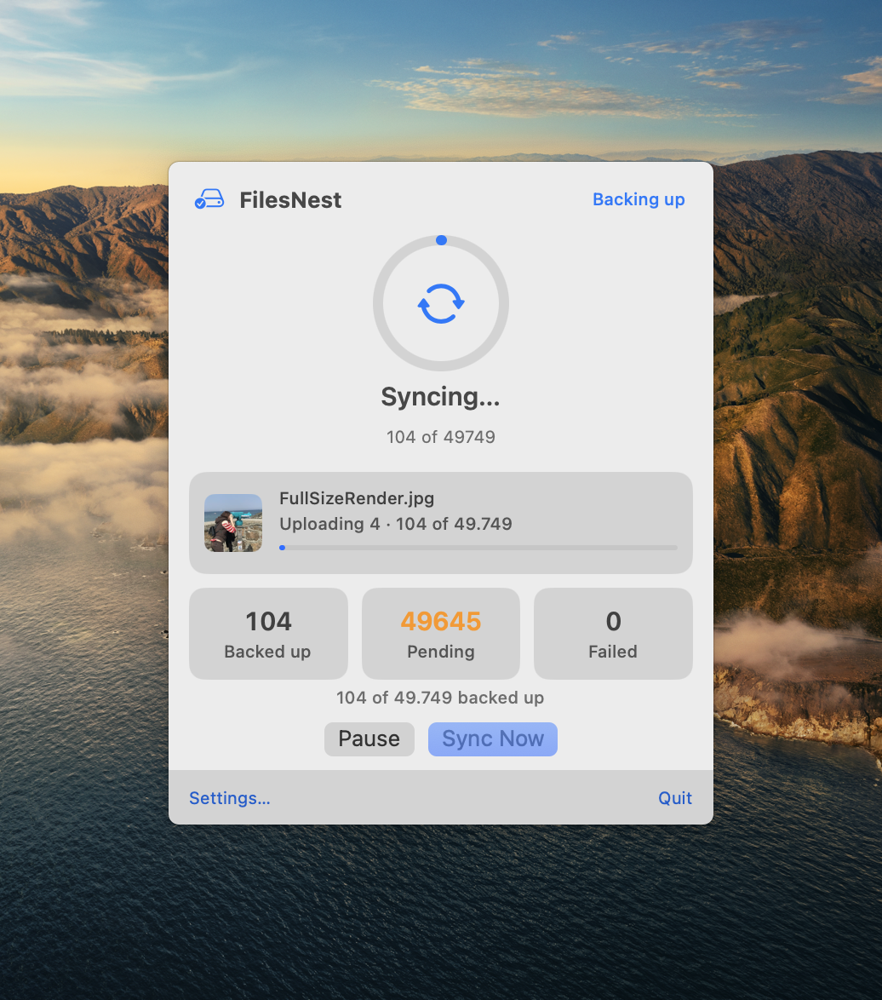
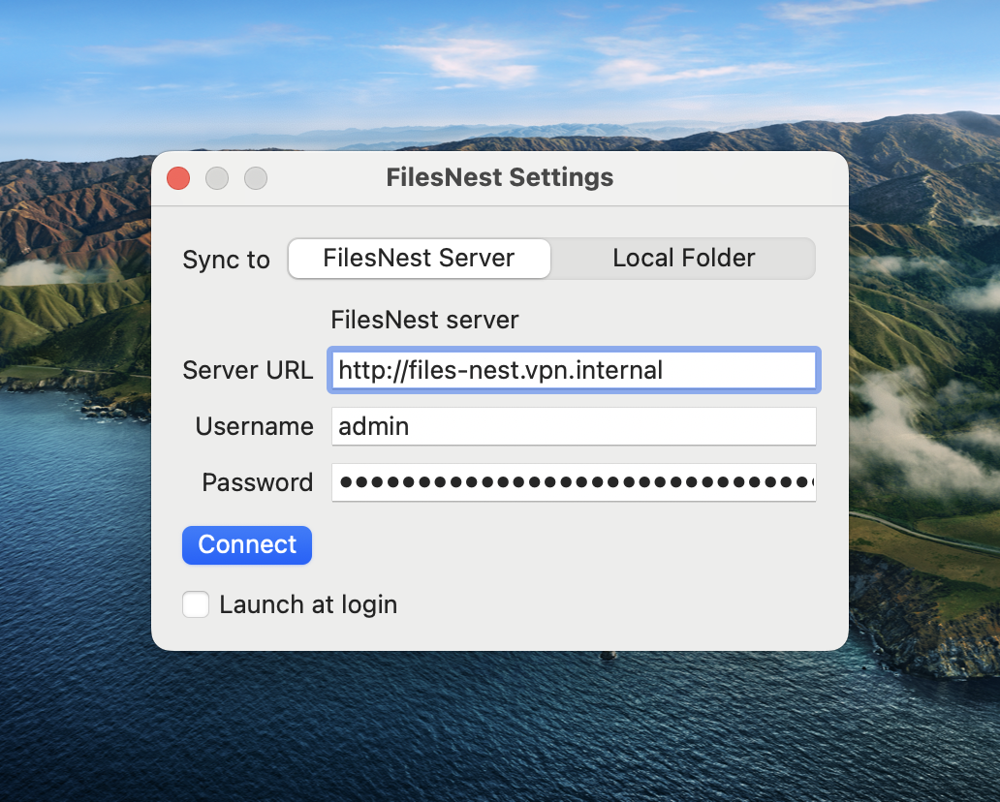
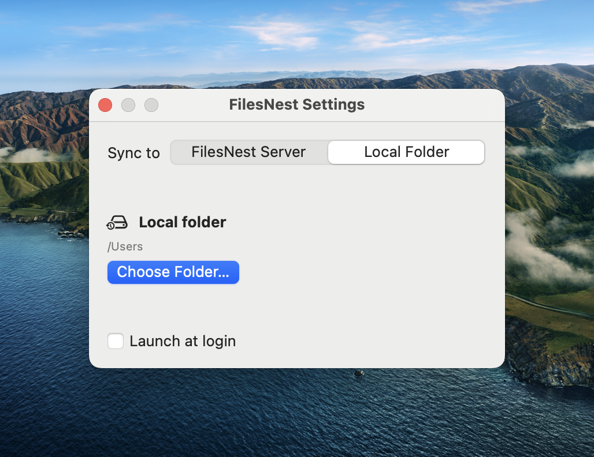

# FilesNest

Mirror your Mac's Photos library to storage you control — a self-hosted server, a local folder, or a mounted drive. No local database on the client — your server is the single source of truth.

**This is a one-way sync, not an archival backup.** The server mirrors what's currently in your Photos library — if you delete a photo on your Mac, its copy on the server is removed too (iCloud is untouched either way). If you want a copy that survives you deleting the original, keep that in mind before relying on this as your only backup.

<p align="center">



</p>

<p align="center"><sub>Menu bar popover — live sync progress, counts, pause/resume &nbsp;·&nbsp; Settings — self-hosted FilesNest server &nbsp;·&nbsp; Settings — or sync to a local folder</sub></p>

## Features

- Continuous one-way sync of your Mac Photos library, running quietly from the menu bar
- Resumable uploads (TUS protocol) — large files and flaky connections survive interruption
- Streams assets directly, no temp files, no whole-file buffering
- Pause, resume, and trigger manual syncs anytime
- Sync counts, progress, and a clear view of failed items
- Credentials stored in the macOS Keychain, never on disk in plain text
- Point it at any server you host — nothing leaves your infrastructure
- Or skip the server entirely: sync straight to a local folder or mounted drive (external disk, NAS share)

## Install the macOS app

**Homebrew (recommended)**

```bash
brew tap moontechs/files-nest https://github.com/moontechs/files-nest
brew trust moontechs/files-nest
brew install --cask filesnest
```

Homebrew 6 refuses to load casks from non-official taps until you explicitly
trust them, failing with `Refusing to load cask ... from untrusted tap`. The
`brew trust` line above clears that for this tap; use
`brew trust --cask moontechs/files-nest/filesnest` to trust only this one cask
instead. Your choice is recorded in `~/.homebrew/trust.json`.

On Homebrew 5.x and older the command doesn't exist (`Unknown command: trust`)
and nothing enforces trust — skip that line and tap/install directly.

**Direct download**

Grab the latest signed and notarized `.dmg` from [Releases](https://github.com/moontechs/files-nest/releases).

Requires macOS 14+.

## Self-hosting the server

A single static Go binary. Easiest path: Docker Compose.

1. Download [`docker-compose.yml`](server/docker-compose.yml) and [`Caddyfile`](server/Caddyfile) into a folder on your server.
2. Set your domain and credentials, then start it:

   ```bash
   DOMAIN=backup.example.com \
   BACKUP_USER=admin \
   BACKUP_PASS=changeme \
   docker compose up -d
   ```

This runs the server plus Caddy with automatic HTTPS (Let's Encrypt). Point the macOS app's Settings at `https://backup.example.com` with the same credentials.

No public domain, bare-metal install, and full config reference: [`server/README.md`](server/README.md).

## How it works

The macOS app streams photos and videos straight from your Photos library to your server over resumable HTTP uploads. It keeps no local database — every sync decision is made by asking the server what it already has. Full architecture: [`docs/architecture.md`](docs/architecture.md).

## License

[AGPL-3.0](LICENSE)
